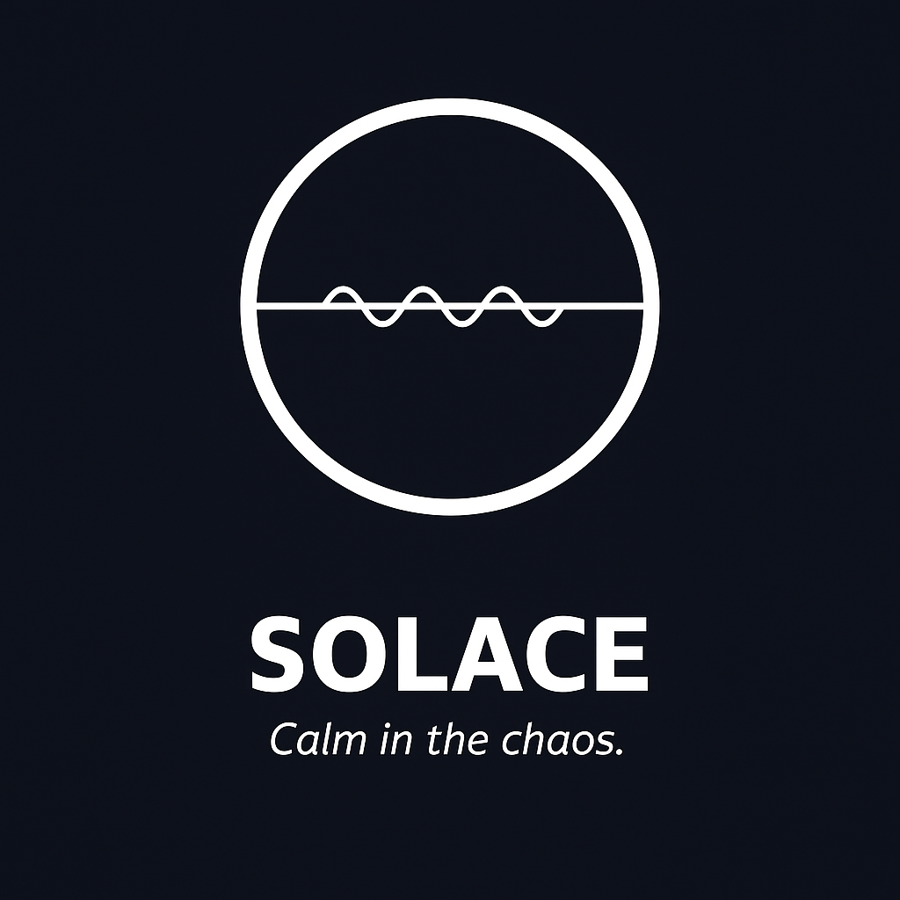

# SOLACE — Calm in the Chaos

Solace is building the world’s first fallback logistics operating system.  
This site is a fully functional demo and pilot toolkit for partners, investors, and early adopters.

---

## What’s Included

- **Live Simulation Builder** — Run industry-specific fallback scenarios
- **Quote Generator** — Dynamic pricing based on fallback profile complexity
- **LOI Generator** — Create investor- or partner-ready Letters of Intent (PDF)
- **Fallback Animation** — Visual reroute logic preview
- **Vertical Landing Pages** — For Pharma, Defense, Government, Retail, Utilities
- **Investor Hub** — Pitch access, roadmap, and patent moat
- **ESG & FAQ Section** — Compliance logic and audit-proofing

---

## Try the Live Tools

- [Fallback Simulation](./simulation.html)
- [Generate LOI](./loi.html)
- [View Animation](./fallback-animation.html)

---

## Contact

To explore a pilot, partnership, or investment:
**Email:** [founder@solace.ai](mailto:founder@solace.ai)

---

> Solace is “calm in the chaos” — engineered to prevent the next supply chain failure.
